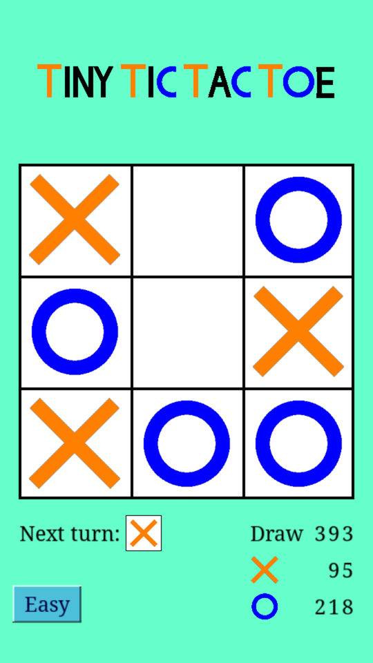
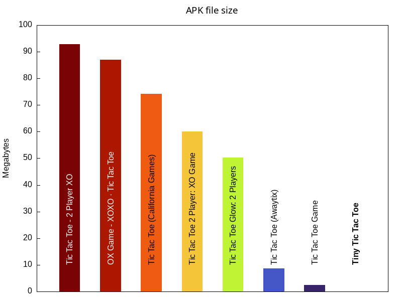

# Tiny Tic Tac Toe for Android

The classic tic-tac-toe game for Android and Linux/X11 written in C.



## Features

### It's tiny

Its APK file is smaller than 60 kB. For comparison:



The bar for _Tiny Tic Tac Toe_ isn't visible because it's so tiny (about half a
pixel).

### Written in C

C is simpler than Java or Kotlin. Using C for this game results in super fast
compile times, fast execution and small memory usage.

### Developer friendly local execution

Run this game directly on your Linux/X11 machine during development. A clean
build takes only 0.125 seconds (on my old laptop, using
[tcc](https://bellard.org/tcc/): `make x11 CC=tcc`). X11 support is the biggest
improvement over this project's inspiration
[VadimBoev/FlappyBird](https://github.com/VadimBoev/FlappyBird).

### No Android app permissions required

Not requesting permissions is something rarely seen in Android apps.

### Open source

Obviously, you have found the source code.

## How to build

First, clone this repository:

```sh
git clone https://github.com/MaxGyver83/TinyTicTacToe.git
cd TinyTicTacToe
```

### How to build for Linux/X11

Install these dependencies (Ubuntu 24.04 package names, might be different for
other distributions):

- `libasound2-dev`
- `libvorbis-dev`
- `libgles2-mesa-dev`

The last one isn't necessary if you have installed the Android NDK (see next
section).

Build and start _TinyTicTacToe_ like this:

```sh
make x11
```

### How to build for Android

Install [Android Studio](https://developer.android.com/studio/) or [Android's
command line
tools](https://developer.android.com/studio#command-line-tools-only), the
Android SDK and NDK.

This project expects these install locations and versions:

```sh
ANDROID_SDK_ROOT=~/Android/Sdk
ANDROID_NDK_ROOT=$ANDROID_SDK_ROOT/ndk/27.2.12479018
ANDROIDVERSION=35
```

If you use other folders or a different version of the NDK, modify the first
lines of [build_apk.sh](./build_apk.sh), [build_aab.sh](./build_aab.sh),
[run.sh](./run.sh) accordingly.

Optionally, copy/symlink your existing keystore to `./keystore.jks` and export
`$KEYSTORE_PASSWORD` and `$KEYSTORE_ALIAS`. Otherwise, replace "`Your Name`",
"`Your Organization`" and "`DE`" in [create_keystore.sh](./create_keystore.sh)
to get a keystore created.

Then start the Android Emulator or connect your Android device via `adb connect`
and run:

```sh
make
```

Without any arguments, `make` will build and install an APK file containing code
for all supported architectures, start the app on the Android device/emulator
and start logging on your local machine.

Use `make apk` to build an APK file only.

Append `ABI=<arch>` to the command to build only for one specific architecture.

Examples: `make ABI=arm64-v8a`, `make apk ABI=x86_64`

### How to build for Google Play Store

First, install Google's [bundletool](https://github.com/google/bundletool).

Then, create an Android app bundle like this:

```sh
make aab
```

To test the created `.aab` file on your Android device, run:

```sh
make run_aab
```

## App in Google Play Store

This app is open source. You can compile it yourself and install it on your
Android device for free.

If you want to thank me for sharing this code, you can buy this app in the
Google Play Store:

<https://play.google.com/store/apps/details?id=com.goodtemperapps.tinytictactoe>

## Variations

### Texts prerendered as 32-bit PNG images

Originally, all texts used in this app were (32-bit RGBA) PNG image files
created with [create_sprites.sh](create_sprites.sh) using `pango-view`. This is
much simpler than creating texts at runtime. _Tiny Tic Tac Toe_ used
[upng](https://github.com/elanthis/upng) for decoding the PNG files. Check out
the `png32bit` tag for the original code.

### Texts prerendered as 8-bit grayscale PNG images

There is a branch named `png8bit` that uses 8-bit grayscale PNG files instead.
This reduces the APK size(s) by 8 kB.

### Texts prerendered as 8-bit grayscale PGM images

But it turned out that 8-bit PGM files
([Netpbm](https://en.wikipedia.org/wiki/Netpbm)) are a better choice. This file
format is so simple that it can be decoded without any library. Netpbm files
contain uncompressed data. But after compression these files are even smaller
than 8-bit PNG files. The best part is that it's not necessary to compress these
files with gzip or similar because APK files are compressed anyway. This also
means that Android decompresses these files automatically when accessed in C
code.

### Texts rendered during runtime using libschrift

Prerendering texts is simple but it doesn't scale well. If you want to create an
app that uses much more text than this one, it might make sense to render all
texts at runtime. Take a look at the `libschrift` branch which uses the
[libschrift](https://github.com/tomolt/libschrift) library for text rendering.

### Variations overview

| Branch/Tag   | APK size arm64-v8a | APK size x86\_64| Assets                      | Libraries  |
|--------------| ------------------:| ---------------:|-----------------------------|------------|
| `png32bit`   | 74 kB              | 74 kB           | PNG files (RGBA)            | upng       |
| `png8bit`    | 66 kB              | 66 kB           | PNG files (8-bit grayscale) | upng       |
| `main`       | 58 kB              | 58 kB           | PGM files                   | -          |
| `libschrift` | 53 kB              | 57 kB           | a minimized font            | libschrift |

## Contributing

I'm sharing this project to help you to start your own project.
I want to keep it simple. This means I don't plan to add more features. I also
don't care about squeezing every last bit of APK size or performance out of it.

But if you find a bug or want to add support for Windows/macOS/any BSD:
Contributions are welcome!

## Credits

Thanks to Vadim Boev for sharing
[VadimBoev/FlappyBird](https://github.com/VadimBoev/FlappyBird). _Tiny Tic Tac
Toe_ is very much inspired by it and re-uses some of its code.

The tick sound used in this game is from [satrebor (Freesound) on
Pixabay](https://pixabay.com/sound-effects/pick-92276/). I have reduced its
length and file size using this command:

```sh
ffmpeg -ss 0.45 -t 0.15 -i pick-92276.mp3 -c:a libvorbis -q:a 4 pick.ogg
```

Thank you all!
